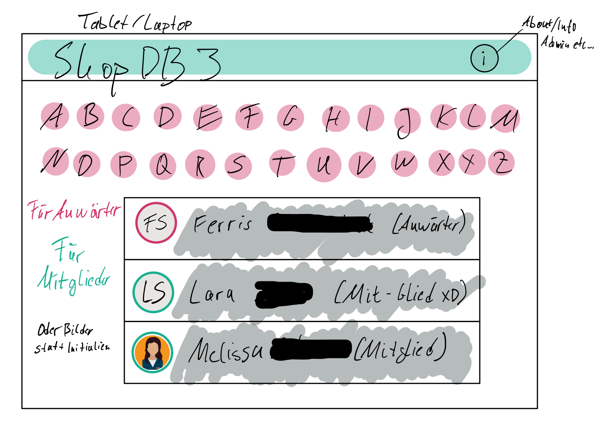
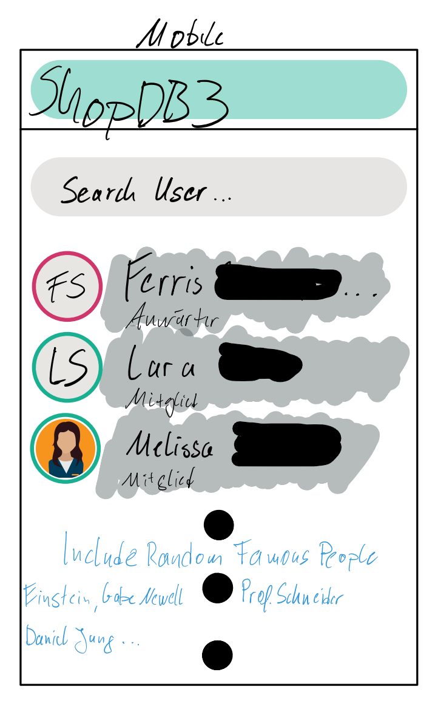
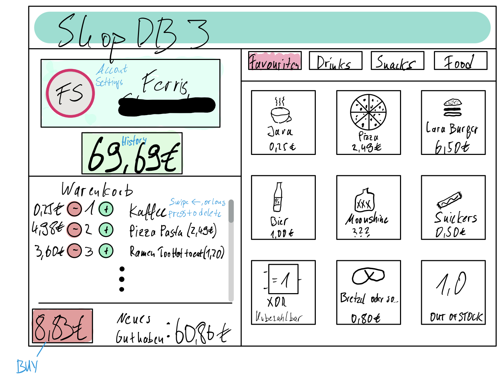
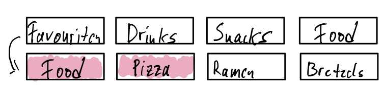

# shopdb3 frontend

Close to shopdb2, but newer.  

## Mockups

Below are some Mockups of the UI. Hardly inspired by shopdb2,

### User Selection

For Tablet/PC

For Mobile

### Product Selection Screen

For Tablet/PC
Note that product quantities were not considered by design time.

With additional subcategories like this

For Mobile  

    throw new NotImplementedException("UUPS!")

## Packages used

Using [Decimal](https://pub.dev/packages/decimal) for working with money values.

## Getting Started

This project is a starting point for a Flutter application.

A few resources to get you started if this is your first Flutter project:

- [Lab: Write your first Flutter app](https://flutter.dev/docs/get-started/codelab)
- [Cookbook: Useful Flutter samples](https://flutter.dev/docs/cookbook)

For help getting started with Flutter, view our
[online documentation](https://flutter.dev/docs), which offers tutorials,
samples, guidance on mobile development, and a full API reference.
